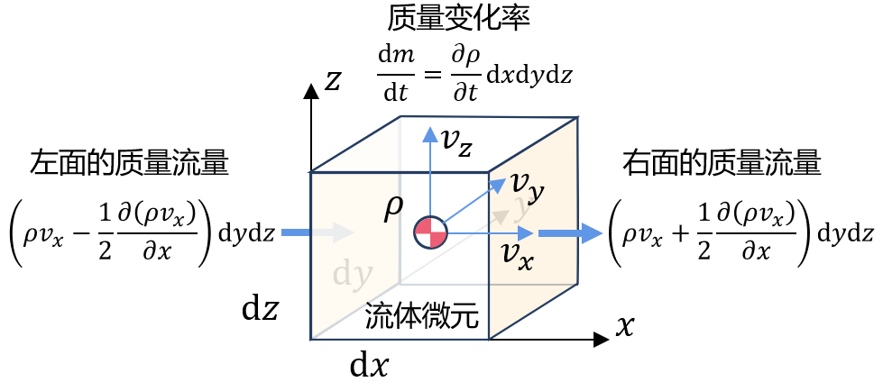

# 流匹配扩散方法 Flow Matching

## 前置知识

### 1 通量与散度
 - 通量：单位时间内通过某个曲面的量，其中$\vec{n}$为曲面的单位法向量，$\mathrm{d}S$为曲面的面积元素，$A$为曲面的矢量场，有
 $$\iint\limits_{\Sigma}\vec{A}\cdot \vec{n}~\mathrm{d}S$$
 - 散度：可用于表征空间各点矢量场发散的强弱程度，对$M$点的散度采用对通量取极限的方式表达，有限体积$\Omega$趋近于点$M$，$V$为$\Omega$的体积，有
 $$\mathrm{div}\vec{A}(M)=\lim\limits_{\Omega \to M} \frac{1}{V}\oiint\limits_{\Sigma}\vec{A}\cdot\vec{n}~\mathrm{d}S $$
 $$ \mathrm{div}\mathbf{F}=\nabla\cdot\mathbf{F}=\frac{\partial F_x}{\partial x}+\frac{\partial F_y}{\partial y}+\frac{\partial F_z}{\partial z}  $$
 $$ \mathrm{div}=\sum_{i=1}^{d}\frac{\partial}{\partial x_i} $$
 概率密度函数的变量变换，假设已知随机变量$z\sim \pi(z)$，存在可逆变换$f:x=f(z)$，则有$z = f^{-1}(x)$，设$x\sim p(x)$，则有
 $$ p(x)= \pi(z)\left| \frac{\mathrm{d}z}{\mathrm{d}x}\right| =\pi\left( f^{-1}(x)\right)\left| \frac{\mathrm{d}f^{-1}}{\mathrm{d}x}\right| = \pi(f^{-1}(x))\left| \left(\mathrm{d}f^{-1}\right)^\prime(x)\right| $$
这是因为概率质量（概率密度函数下的面积）在坐标变换过程中必须守恒。通俗地说，同一个随机事件，无论在$z$坐标系下描述还是$x$坐标系下描述，其发生的总概率（面积）是一样的。当将坐标$z$变换为$x$，空间的“度量”发生了变化，为了抵消这种空间尺度的变化，密度必须乘以一个缩放因子，这个因子就是Jacobian行列式的绝对值$\left|\frac{\mathrm{d}z}{\mathrm{d}x}\right|$。其数学推导过程如下：

我们需要证明的是，找到$x$落到某个小区间$[x,x+\mathrm{d}x]$内的概率，等于找到对应的$z$落到小区间$[z,z+\mathrm{d}z]$内的概率。设定：
 - $x=f(z)$是单调递增函数（方便理解，结果对单调递减同样适用）。

（1）写出$x$发生的概率：
$$P(x\le X \le x+\mathrm{d}x) = p(x)\cdot\mathrm{d}x$$

（2）写出$z$发生的概率：

因为$x=f(z)$，所以$x+\mathrm{d}x$对应的就是$z+\mathrm{d}z$，这两个事件是完全等价的（是同一个物理状态的两种描述），所以其概率必须相等
$$P(x\le X \le x+\mathrm{d}x) = P(z\le Z \le z+\mathrm{d}z) $$
即$$p(x)\cdot\mathrm{d}x = \pi(z)\cdot\mathrm{d}z$$
求解$p(x)$ $$p(x)=\pi(z)\cdot\frac{\mathrm{d}z}{\mathrm{d}x}$$加入绝对值和逆变换，因为概率密度不能是负数，如果导数$\frac{\mathrm{d}z}{\mathrm{d}x}$为负，就要加绝对值。

### 2 连续性方程

连续性方程式流体力学中重要的方程，本质来源于质量守恒。

根据质量守恒关系，体积内的质量变化等于流入质量减去流出质量
$$\triangle m = \triangle m_{in} - \triangle m_{out}$$
取极限形式就是体积内的质量变化率等于单位时间流入与流出的质量差，其中质量变化率为
$$\frac{\mathrm{d}m}{\mathrm{d}t} = \frac{\partial\rho}{\partial t}\mathrm{d}x\mathrm{d}y\mathrm{d}z=\frac{\mathrm{d}m_{in}}{\mathrm{d}t}-\frac{\mathrm{d}m_{out}}{\mathrm{d}t}$$

由于$\rho(x,y,z,t)$所以密度对时间就变成偏导数了。

流量是单位时间内通过某界面的体积，$$Q=A\cdot \mathbf{v}$$其中$A$为截面面积，$\mathbf{v}$为速度矢量。

以流体微元中心处为参考点，其$x y z$方向速度分别表示为$v_x,v_y,v_z$，对$x$方向而言，其单位流入质量$\frac{\mathrm{d}m_{in}}{\mathrm{d}t}$表达为左侧面的质量流量减去右侧面的质量流量，即
$$\left( \frac{\mathrm{d}m}{\mathrm{d}t} \right)_x = \left( \frac{\mathrm{d}m_{in}}{\mathrm{d}t} \right)_x - \left( \frac{\mathrm{d}m_{out}}{\mathrm{d}t} \right)_x\\=\left(  \rho v_x - \frac{1}{2}\frac{\partial(\rho v_x)}{\partial x}\mathrm{d}x\mathrm{d}y\mathrm{d}z \right) - \left(  \rho v_x + \frac{1}{2}\frac{\partial(\rho v_x)}{\partial x}\mathrm{d}x\mathrm{d}y\mathrm{d}z \right) = -\frac{\partial(\rho v_x)}{\partial x}\mathrm{d}x\mathrm{d}y\mathrm{d}z$$

为什么是这样呢？我们可以简单想见，中间截面$x$方向的质量流量为$\rho v_x \mathrm{d}y\mathrm{d}z$，其中$v_x$为$x$方向的速度但应该理解为单位面积的体积流量，与$\rho$相乘后就成为了单位面积的质量流量，$\mathrm{d}y\mathrm{d}z$为微元的面积，最终为该面积的质量流量。而根据泰勒展开，我们用一阶近似来分别表达左右面的流速，如左面流速约等于$ \rho v_x - \frac{\partial(\rho v_x)}{\partial x}\mathrm{d}x\mathrm{d}y\mathrm{d}z $，其中$\frac{\partial(\rho v_x)}{\partial x}\mathrm{d}x$是一阶微分与步长相乘，即质量流量沿着$x$方向的增量。

我们结合$x,y,z$三个方向的质量流量，就可以根据质量守恒构造出连续性方程的微分形式：

$$ \frac{\mathrm{d}m}{\mathrm{d}t} =  \left( \frac{\mathrm{d}m}{\mathrm{d}t} \right)_x + \left( \frac{\mathrm{d}m}{\mathrm{d}t} \right)_y + \left( \frac{\mathrm{d}m}{\mathrm{d}t} \right)_z $$

$$\frac{\partial\rho}{\partial t}\mathrm{d}x\mathrm{d}y\mathrm{d}z = -\frac{\partial(\rho v_x)}{\partial x}\mathrm{d}x\mathrm{d}y\mathrm{d}z-\frac{\partial(\rho v_y)}{\partial y}\mathrm{d}x\mathrm{d}y\mathrm{d}z-\frac{\partial(\rho v_z)}{\partial z}\mathrm{d}x\mathrm{d}y\mathrm{d}z = - \nabla \rho \mathbf{v}\mathrm{d}x\mathrm{d}y\mathrm{d}z$$
由于
$$\nabla (\rho \mathbf{v}) = \frac{\partial(\rho v_x)}{\partial x}+ \frac{\partial(\rho v_y)}{\partial y}+ \frac{\partial(\rho v_z)}{\partial z}$$
故原式可以化简为
$$\frac{\partial\rho}{\partial t} + \nabla (\rho \mathbf{v}) =0$$

## Flow Matching方法

### 1 训练流程

用神经网络学习一个向量流场：$v_t^\theta$，其损失函数定义为
$$\mathcal{L}(\theta) = \mathbb{E_{t,p_t(x)}} \lVert v_t^\theta(x_t) - v_t^{target}(x_t) \rVert^2$$

如何获得$v_t^{target}(x_t)$？我们可以自己构建一个流。我们首先构造一个从原始分布$p_0(x)$到目标分布$p_1(x)$的平滑过渡连续分布族$p_t(x)$，$t\in [0,1]$，$p_t(x)$平滑地从$p_0(x)$过渡到$p_1(x)$:
$$\psi_t^{target}(x_0|z)=\alpha_t z+ \beta_t x_0 $$

最常用的是衍生自最优传输理论且最简单直观的整合流（Rectified Flow）,即对原始分布和目标分布进行线性插值，定义如下：

$$ \psi_t^{target}(x_0|z) = x_t = t z + (1-t)x_0 $$

其中$x_0 \sim p_0(x)$是采样自已知初始分布的样本，$z \sim p_1(x)$是采样自真实分布的样本。除了线性插值，也可用指数插值$x_t = e^{-t}x_0 + (1-e^{-t})z$，核心是保证$p_t(x)$的连续性。则速度向量场的目标为：

$$v_t^{target}(x_t|z) = v_t^{target}(\psi_t^{target}(x_0|z)|z) \\
= \frac{\mathrm{d}\psi_t^{target}(x_0|z)}{\mathrm{d}t} = \frac{\mathrm{d}\alpha_t}{\mathrm{d}t} z + \frac{\mathrm{d}\beta_t}{\mathrm{d}t} x_0$$

对整合流而言，条件目标速度向量场为：

$$v_t^{target}(x_t|z) = z - x_0$$

**训练流程**
1. 从训练数据里随机获取图片$z$
2. 随机获取一个时间$t, ~t\in[0,1]$
3. 随机获取一个多维噪声$\epsilon$作为$x_0,~\epsilon\sim N(0,I)$
4. 根据流公式计算$x_t = t z + (1-t)x_0$
5. 对神经网络传入$t$和$x_t$，计算输出$v_t^\theta(x_t)$作为预测值
6. 用条件向量场公式$z-x_0$作为Label值
7. 计算预测值和Label之间的MSE误差，并反向传播更新参数

**生成流程**
神经网络学习到的向量场：$u_t^{\theta}$，步数：$n$，采样间隔：$h=\frac{1}{n}$。
1. 设置$t=0$，设置时间间隔$h = \frac{1}{n}$
2. 从$p_0(x)$采样$x_0$
3. **for $i=1,\dots, n-1$ do**
4. $~~~~~~x_{t+h} = x_t + h u_t^{\theta}(x_t)$
5. $~~~~~~t = t + h$
6. **end for**
7. **return $x_1$**

### 2 条件向量训练可行性

我们希望学习得到的是边缘向量场：$v_t^\theta$，其不依赖于真值$z$，那么我们使用条件向量场计算出来的速度向量$v_t^{target}(x_t|z)$是否可以拿来当做训练的label？即是否可以将

$$\mathcal{L}_{FM}(\theta) = \mathbb{E_{t\sim\mathcal{U},x\sim p_t}} \left[\lVert v_t^\theta(x_t) - v_t^{target}(x_t) \rVert^2 \right]$$

替换为有条件的

$$\mathcal{L}_{CFM}(\theta) = \mathbb{E_{t\sim\mathcal{U},x\sim p_t(\cdot|z),z\sim p_1}} \left[\lVert v_t^\theta(x_t) - v_t^{target}(x_t|z) \rVert^2 \right]$$

其实是可以的，如果从直觉上理解，选择了一个batch的数据进行训练，网络学习了针对这些数据的向量场，只要不断更换batch数据，最终网络学到的向量场是所有可能数据的平均，泛化为一个无条件的向量场。下面来进行证明：

我们有了条件向量场，现在需要求出边缘向量场，也就是不依赖于$z$的向量场。边缘概率路径是对条件概率路径乘以条件$z$的概率然后对所有可能的$z$积分，即
$$p_t(x) = \int_{z} p_t(x|z)p_1(z)\mathrm{d}z$$
本质上应用了全概率公式，按照各种条件对$z$进行汇总，然后对所有可能的$z$积分。那么是否可以通过对所有条件向量场乘以$p(z)$，然后对所有可能的$z$积分，得到边缘向量场？即
$$v_t^{target}(x) = \int_{z} v_t^{target}(x|z)p_1(z)\mathrm{d}z$$

答案是不行的，因为这里的$v_t^{target}$是个向量场，不是概率值，不能应用全概率公式。实际上的公式是这样的

$$v_t^{target}(x) = \int_{z} v_t^{target}(x|z)p_t(z|x)\mathrm{d}z$$

我们可以利用贝叶斯公式$p_t(z|x)=\frac{p_t(x|z)p(z)}{p_t(x)}$转化一下上述边缘向量场公式，得到
$$v_t^{target}(x) = \int_{z} v_t^{target}(x|z)\frac{p_t(x|z)p_1(z)}{p_t(x)}\mathrm{d}z$$
这个表达式在后面证明时会用到。

接下来就来证明为什么边缘向量场的公式是那样的。我们需要验证的是这个边缘向量场公式符合连续性方程：

$$\frac{\partial p_t(x)}{\partial t} + \nabla \left(p_t(x) v_t^{target}(x)\right) =0$$

**证明**：
连续性方程第一项，概率密度对时间求导，代入边缘概率的公式
$$\frac{\partial p_t(x)}{\partial t} = \frac{\partial}{\partial t}\int_z p_t(x|z)p_1(z)\mathrm{d}z$$
然后将求导符号移入积分符号，其中$p(z)$可以看做常数项
$$= \int_z \frac{\partial p_t(x|z)}{\partial t}p_1(z)\mathrm{d}z$$
偏导部分满足连续方程，可代入
$$= \int_z -\nabla \left(p_t(x|z) v_t^{target}(x|z)\right)p_1(z)\mathrm{d}z$$
因为散度计算是对$x$进行的，而这里的积分是对$z$进行的，所以可以将散度符号移到积分号外边
$$= -\nabla \left(\int_z p_t(x|z) v_t^{target}(x|z)p_1(z)\mathrm{d}z\right)$$
下一步在积分号外乘$p_t(x)$，在积分号内除$p_t(x)$，得到
$$= -\nabla \left(p_t(x)\int_z  v_t^{target}(x|z)\frac{p_t(x|z)p_1(z)}{p_t(x)}\mathrm{d}z\right)$$
可以发现这里的积分项就是我们之前定义的边缘向量场公式，故上式为
$$ = -\nabla \left(p_t(x) v_t^{target}(x)\right)$$

### 3 条件向量训练损失函数

需要证明两种Loss在优化上等价，即
$$\mathcal{L}_{FM}(\theta) = \mathcal{L}_{CFM}(\theta) + C$$

复习公式：
$$\lVert a - b \rVert^2 = \lVert a \rVert^2 - 2a^T b + \lVert b \rVert^2$$

我们将误差的期望改写成3项分别的期望

$$\mathcal{L}_{FM}(\theta) = \mathbb{E_{t\sim\mathcal{U},x\sim p_t}} \left[\lVert v_t^\theta(x_t) \rVert^2 -2u_t^{\theta}(x_t)^T u_t^{target}(x_t) + \lVert v_t^{target}(x_t) \rVert^2 \right] $$
$$ = \mathbb{E_{t\sim\mathcal{U},x\sim p_t}} \left[\lVert v_t^\theta(x_t) \rVert^2\right] -2\mathbb{E_{t\sim\mathcal{U},x\sim p_t}} \left[u_t^{\theta}(x_t)^T u_t^{target}(x_t)\right] + 

\underbrace{\mathbb{E_{t\sim\mathcal{U},x\sim p_t}} \left[\lVert v_t^{target}(x_t) \rVert^2 \right]}_{C_1}

$$
最后一项与我们要优化的$\theta$无关，是一个常数，令其为$C_1$。我们接下来主要对其中第二部分进行分析，将这个期望写成积分的形式
$$\mathbb{E_{t\sim\mathcal{U},x\sim p_t}} \left[u_t^{\theta}(x_t)^T u_t^{target}(x_t)\right] = \int_0^1 \int_x p_t(x) u_t^{\theta}(x)^T u_t^{target}(x_t) \mathrm{d}x \mathrm{d}t$$

下一步将边缘向量场$u_t^{target}(x)$的公式代入
$$= \int_0^1 \int_x p_t(x) u_t^{\theta}(x)^T \left[\int_{z} u_t^{target}(x|z)\frac{p_t(x|z)p_1(z)}{p_t(x)}\mathrm{d}z\right] \mathrm{d}x \mathrm{d}t$$

将积分符号移动到前面，后面统一对z,x,t积分

$$ = \int_0^1 \int_x \int_z p_t(x) u_t^{\theta}(x)^T  u_t^{target}(x|z)\frac{p_t(x|z)p_1(z)}{p_t(x)}\mathrm{d}z \mathrm{d}x \mathrm{d}t$$

$$ = \int_0^1 \int_x \int_z  u_t^{\theta}(x)^T  u_t^{target}(x|z)p_t(x|z)p_1(z)\mathrm{d}z \mathrm{d}x \mathrm{d}t$$

我们发现后面两项都是概率，一个是条件概率路径$p_t(x|z)$，一个是真实数据的边缘分布$p_1(z)$，我们重新转化为期望的形式就可以去掉这两个概率

$$ = \mathbb{E_{t\sim\mathcal{U},x\sim p_t(\cdot|z),z\sim p_1}} \left[\lVert u_t^{\theta}(x)^T  u_t^{target}(x|z) \rVert^2 \right] $$

我们将新的第二项的期望表达式代入原始的$\mathcal{L}_{FM}(\theta)$,得到
$$\mathcal{L}_{FM}(\theta)  = \mathbb{E_{t\sim\mathcal{U},x\sim p_t}} \left[\lVert v_t^\theta(x_t) \rVert^2\right] 

-2\mathbb{E_{t\sim\mathcal{U},x\sim p_t(\cdot|z),z\sim p_1}} \left[\lVert u_t^{\theta}(x)^T  u_t^{target}(x|z) \rVert^2 \right] + C_1$$

$$ = \mathbb{E_{t\sim\mathcal{U},x\sim p_t(\cdot|z),z\sim p_1}} \left[\lVert v_t^\theta(x_t) \rVert^2 

-2u_t^{\theta}(x)^T  u_t^{target}(x|z) \rVert^2 \right] + C_1$$

上一步可行的原因是根据全概率公式$p_t(x)=\int_z p_t(x|z)p_1(z)\mathrm{d}z$，可以得到
$$z\sim p_1, x\sim p_t(\cdot|z) \Rightarrow x\sim p_t$$

这里也把两个期望进行了合并。接下来，我们加上一个再减去一个条件向量场计算出来的向量长度的平方，得到

$$ = \mathbb{E_{t\sim\mathcal{U},x\sim p_t(\cdot|z),z\sim p_1}} \left[\lVert v_t^\theta(x_t) \rVert^2 

-2u_t^{\theta}(x)^T  u_t^{target}(x|z) \rVert^2 + \lVert v_t^{target}(x_t|z) \rVert^2 - \lVert v_t^{target}(x_t|z) \rVert^2 \right] + C_1$$

$$ = \mathbb{E_{t\sim\mathcal{U},x\sim p_t(\cdot|z),z\sim p_1}} \left[\lVert v_t^\theta(x_t) - v_t^{target}(x_t|z) \rVert^2 \right] -

\mathbb{E_{t\sim\mathcal{U},x\sim p_t(\cdot|z),z\sim p_1}} \left[\lVert v_t^{target}(x_t|z) \rVert^2  \right] + C_1$$

$$=\mathcal{L}_{CFM}(\theta) + C_2 + C_1 = \mathcal{L}_{CFM}(\theta) + C$$

$$
      \begin{aligned}
      \min_{u_0,\cdots,u_{N_p-1}} J &= \frac{1}{2}x^T_{N_p}Q_{N_p}x_{N_p} + x^T_{N_p}p_{N_p} + q_{N_p} + \sum_{k=0}^{N_p-1} \left(\frac{1}{2}x^T_kQ_kx_k + x_k^Tp +q + u^T_k R_k u_k + u_k^Tr \right) \\
      \text{s.t.}\quad x_{k+1} &= f(x_k,u_k)\\
      x_0 &= x^{start}
      \end{aligned}
$$

### 1. 基础参数定义（LaTeX公式）

### 2. 时间维度的离散方法（核心离散逻辑）
代码中对时间 $t$ 采用**等步长均匀离散**，离散规则的LaTeX表达：
- 离散区间：$t \in [0, 5]$
- 离散步长：$\Delta t = 0.2$
- 离散时间序列：
$$
t_k = 0 + k \cdot \Delta t, \quad k = 0, 1, 2, \dots, 25
$$
（注：$k$ 取0到25共26个离散点，对应MATLAB中 `t = 0:0.2:5`，最后一个点为 $t=5$）

### 3. 挂车角度 $\theta(t)$ 计算公式
挂车角度 $\theta(t)$ 是曳物线轨迹的核心中间变量，对应MATLAB中 `th = pi-2*atan(tan((pi-gamma)/2)*exp(v/L*t))`，LaTeX表达式：

（说明：MATLAB中 `atan` 对应LaTeX的 $\arctan$，`exp()` 对应自然指数 $e^\cdot$，运算优先级与代码完全一致）

### 4. 挂车后轴曳物线轨迹坐标
挂车后轴的横/纵坐标（核心曳物线轨迹）对应MATLAB中 `trailer.x`/`trailer.y`，LaTeX公式：
$$
\theta(t) = \pi - 2 \arctan\left( \tan\left( \frac{\pi - \gamma}{2} \right) \cdot e^{\frac{v}{L} \cdot t} \right)
$$
$$
x_{\text{tractor}}(t) = v_x \cdot t + L_g \cdot \cos\gamma,
\quad
y_{\text{tractor}}(t) = L_g \cdot \sin\gamma
$$
$$
x_{\text{trailer}}(t) = - L_g  \left( \ln\left( \tan\frac{\theta(t)}{2} + \cos\theta(t) \right) \right) + L_g  \left( \ln\left( \tan\frac{\gamma}{2} + \cos\gamma \right) \right) 
$$
$$
y_{\text{trailer}}(t) = -L_g \cdot \left( \sin\theta(t) - \sin\gamma \right)
$$

（说明：MATLAB中 `log` 为自然对数，与LaTeX $\log$ 一致；公式保留了代码中的负号和括号优先级，$y$ 公式可简化但与代码逻辑完全等价）

### 5. 牵引车坐标计算公式
对应MATLAB中 `tractor.x`/`tractor.y`，LaTeX公式：

（说明：MATLAB中 `0*t` 表示纵坐标恒为常数，公式中已简化，不改变计算结果）

### 总结
1. 核心逻辑：挂车后轴曳物线轨迹由角度 $\theta(t)$ 推导，$\theta(t)$ 是时间 $t$ 的指数函数，最终坐标通过三角函数/对数运算得到；
2. 离散方法：时间轴采用 $\Delta t=0.2$ 的等间距离散，覆盖 $[0,5]$ 共26个计算点；
3. 公式适配：所有LaTeX公式与MATLAB代码的符号、正负号、运算优先级完全一致，可直接用于论文/报告排版。